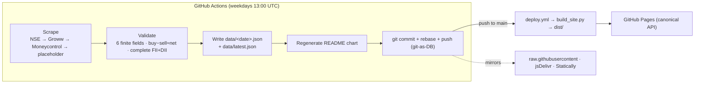
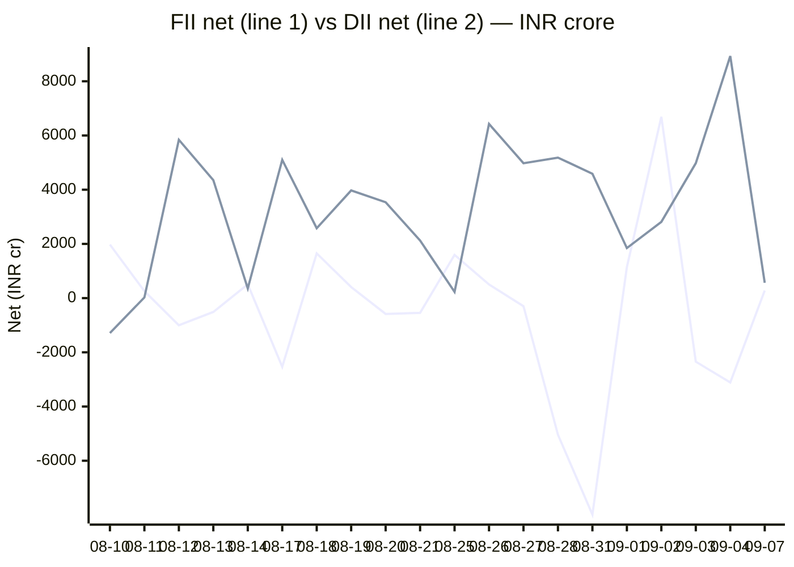

# FII/DII Activity API

**Daily FII/DII net buy/sell activity for Indian markets — scraped by GitHub Actions, served as static JSON. Zero servers, zero ongoing cost.**

[](LICENSE)
[](https://github.com/chirag127/fii-dii-activity-api/stargazers)
[](https://github.com/chirag127/fii-dii-activity-api/commits)
[](https://www.python.org/)
[](https://github.com/chirag127/fii-dii-activity-api/actions/workflows/ci.yml)

Daily **FII** (Foreign Institutional Investors) and **DII** (Domestic Institutional
Investors) net buy/sell activity for Indian equity markets — scraped by GitHub Actions
and served as static JSON via GitHub Pages and `raw.githubusercontent.com`. A Python
job runs after NSE close, validates the parse, commits it to the repo (git-as-DB), and
GitHub Pages publishes a self-contained site + the raw JSON API.

- **Live site:** https://fii-dii-activity-api.oriz.in
- **GH Pages (canonical API/landing):** https://chirag127.github.io/fii-dii-activity-api/
- **Repo:** https://github.com/chirag127/fii-dii-activity-api

⭐ If this is useful, please **star the repo** — it helps others find it.


<sub>Live site screenshot, auto-captured from the deployed page by `fii-dii` screenshot tooling.</sub>

## Contents

- [Data flow](#data-flow) · [Chart](#chart) · [Endpoints](#endpoints-static-json) · [Response shape](#response-shape-latestjson)
- [How it works](#how-it-works) · [Project layout](#project-layout) · [CLI reference](#cli-reference)
- [Quick start](#quick-start) · [Configuration](#configuration) · [Testing](#testing) · [Schedule](#schedule)

## Data flow



## Chart

<!-- CHART:BEGIN -->
**FII vs DII net equity flow (₹ crore, most recent sessions)**



<sub>FII = first line, DII = second line. Auto-generated from `data/` by `python -m fii_dii.chart` on each scrape. Last 20 session(s).</sub>
<!-- CHART:END -->

## Endpoints (static JSON)

The **canonical** base URL is GitHub Pages — it never expires and has no external DNS
dependency. The raw and CDN URLs are equivalent mirrors of the same committed data.

| URL | Description |
| --- | --- |
| `https://chirag127.github.io/fii-dii-activity-api/data/latest.json` | **Canonical** — most recent scrape |
| `https://chirag127.github.io/fii-dii-activity-api/data/<YYYY-MM-DD>.json` | Canonical — a specific day |
| `https://raw.githubusercontent.com/chirag127/fii-dii-activity-api/main/data/latest.json` | Mirror via raw (no Pages dependency) |
| `https://raw.githubusercontent.com/chirag127/fii-dii-activity-api/main/data/<YYYY-MM-DD>.json` | Mirror via raw — a specific day |
| `https://cdn.jsdelivr.net/gh/chirag127/fii-dii-activity-api@main/data/latest.json` | Mirror via jsDelivr CDN (cached, fast) |
| `https://cdn.statically.io/gh/chirag127/fii-dii-activity-api/main/data/latest.json` | Mirror via Statically CDN |

Machine-readable contract: [`openapi.yaml`](./openapi.yaml) — OpenAPI 3.1, two GET
endpoints, four equivalent servers (import into RapidAPI, Postman, Swagger UI, etc.):

| Method + path | operationId | Purpose |
| --- | --- | --- |
| `GET /latest.json` | `getLatest` | Most recent daily FII/DII payload |
| `GET /{date}.json` | `getByDate` | Payload for a specific `YYYY-MM-DD` trading day (404 if none) |

## Response shape (`latest.json`)

```json
{
  "date": "2026-07-21",
  "source": "nse",
  "equity":     { "fii_buy": 5917.71, "fii_sell": 5004.12, "fii_net": 913.59, "dii_buy": 6440.88, "dii_sell": 5165.66, "dii_net": 1275.22 },
  "derivative": { "fii_buy": 0, "fii_sell": 0, "fii_net": 0, "dii_buy": 0, "dii_sell": 0, "dii_net": 0 }
}
```

`source` is one of `nse`, `groww` (primary working source), `moneycontrol` (fallback),
or `placeholder` (all failed → all zeros). All values are INR crores. `equity` is the
Capital Market (cash) segment; `derivative` is reserved for F&O and is currently always
zero (the upstreams report cash only).

## How it works

1. **Fetch** — `scrape.py` tries NSE's `fiidii` JSON API, then Groww's server-rendered
   cash data (primary working source), then Moneycontrol; if all fail it writes an
   all-zero `placeholder`.
2. **Parse** — `selectolax` reads the server-rendered tables; `toNumber`-style
   normalization handles `1,234.50`, `₹`, and accounting `(913.59)` → `-913.59`.
3. **Validate** — a scrape is accepted **only if it validates and carries complete FII
   _and_ DII equity data** (all six fields finite, `buy − sell ≈ net` within ±1 cr) — a
   partial or all-zero parse is rejected and falls through to the next source, so a bad
   upstream can never overwrite good data with zeros.
4. **Write** — the accepted payload is written to `data/<date>.json` + `data/latest.json`
   (git-as-DB: committed back with a rebase-before-push guard).
5. **Publish** — the chart is regenerated, the commit is pushed, and `deploy.yml`
   rebuilds the self-contained static site to GitHub Pages; mirrors follow automatically.

## Project layout

| Path | Purpose |
| --- | --- |
| `src/fii_dii/__main__.py` | Scrape entry point (CLI `fii-dii-scrape`) — NSE → Groww → Moneycontrol → placeholder, validates, writes `data/`. |
| `src/fii_dii/scrape.py` | Per-source fetchers: `try_nse`, `try_groww`, `try_moneycontrol`. |
| `src/fii_dii/schema.py` | Pure, tested core: `build_payload`, `validate_payload`, `has_complete_equity`. |
| `src/fii_dii/chart.py` | Regenerates the Mermaid chart between the `<!-- CHART -->` markers (CLI `fii-dii-chart`). |
| `src/fii_dii/build_site.py` | Builds the dependency-free static site (`dist/`) for Pages: `index.html` + inline SVG chart + `data/` + `openapi.yaml` (CLI `fii-dii-build`). |
| `src/fii_dii/manifest.py` | Builds a data manifest (CLI `fii-dii-manifest`). |
| `src/fii_dii/screenshot.py` | Captures `docs/screenshot.png` from the live/local site via Playwright. |
| `src/fii_dii/backfill.py` | One-off historical backfill of `data/`. |
| `data/*.json` | The API payloads — one file per trading day plus `latest.json`. |
| `openapi.yaml` | OpenAPI 3.1 contract. |
| `.github/workflows/` | `scrape.yml` (cron), `ci.yml` (tests), `deploy.yml` (Pages), `megalinter.yml`. |

## CLI reference

Installed as console scripts (see `pyproject.toml`):

| Command | Purpose |
| --- | --- |
| `fii-dii-scrape` | Fetch today's data → `data/<today>.json` + `data/latest.json` |
| `fii-dii-chart` | Regenerate the README Mermaid chart from `data/` |
| `fii-dii-manifest` | Build the data manifest |
| `fii-dii-build` | Build the static site (`dist/`) — what GitHub Pages serves |

## Quick start

```bash
pip install -e ".[dev]"
python -m pytest -q               # offline test suite (deterministic)

fii-dii-scrape                    # real scrape (NSE may 404 from non-browser IPs — expected, falls back)
fii-dii-chart                     # refresh the README chart
fii-dii-build                     # build the site into dist/
npx serve dist                    # preview at http://localhost:3000
```

## Configuration

Env vars only — never hardcoded. Names + purpose:

| Variable | Purpose |
|---|---|
| `TELEGRAM_BOT_TOKEN` | Telegram bot token for daily notify (optional) |
| `TELEGRAM_CHAT_ID` | Target Telegram chat id (optional) |
| `SITE` | Base URL for the screenshot tool (defaults to the live site) |

## Testing

`python -m pytest -q`. The suite covers `toNumber`/parse edge cases, payload
validation and `has_complete_equity`, every committed `data/*.json` being schema-valid,
the README chart block being present, and `openapi.yaml` being a valid 3.1 spec that
documents both endpoints and all servers. CI (`ci.yml`) runs the offline suite, asserts
the chart is not stale, and confirms the static site builds — on every push and PR.

## Schedule

Weekdays 13:00 UTC (`0 13 * * 1-5`, ~18:30 IST, after NSE close). Manually re-runnable
via the **scrape** workflow (`workflow_dispatch`).

## Part of the broader fleet

One of ~80 solo-run sites in a family of finance tools, blogs, and utilities. This
one is **hosted free on GitHub Pages + GitHub Actions** (no Cloudflare, no backend,
no ongoing cost) — the scrape runs on free Actions minutes and the data is served
as static files.

## Contributing

Issues and PRs welcome — see [CONTRIBUTING.md](./CONTRIBUTING.md) and
[SECURITY.md](./SECURITY.md). Conventional commits — they **are** the changelog.

## License

MIT © Chirag Singhal

## Status / roadmap

Stable, running daily. Roadmap: derivatives (F&O) block once a keyless source exposes
it, longer historical backfill.

---

**Disclaimer:** General information, not investment advice. Institutional-flow data is
descriptive, not a trade signal — do your own research.
